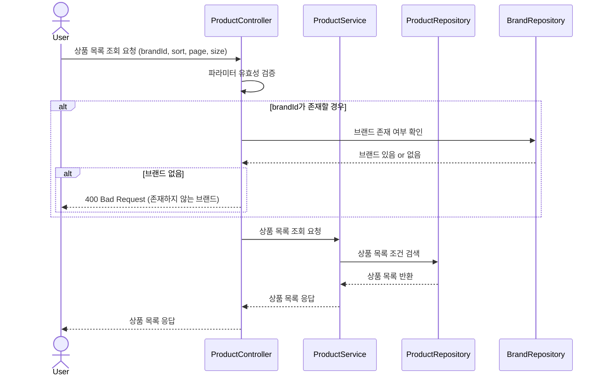
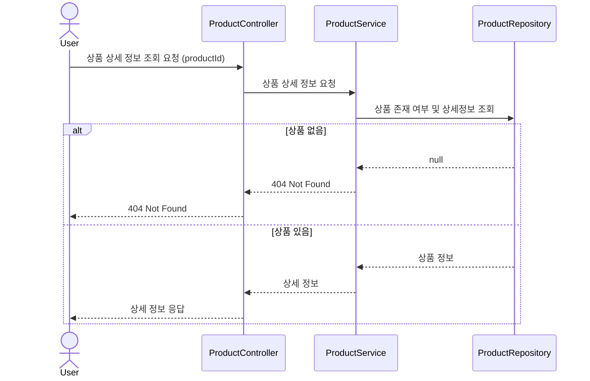
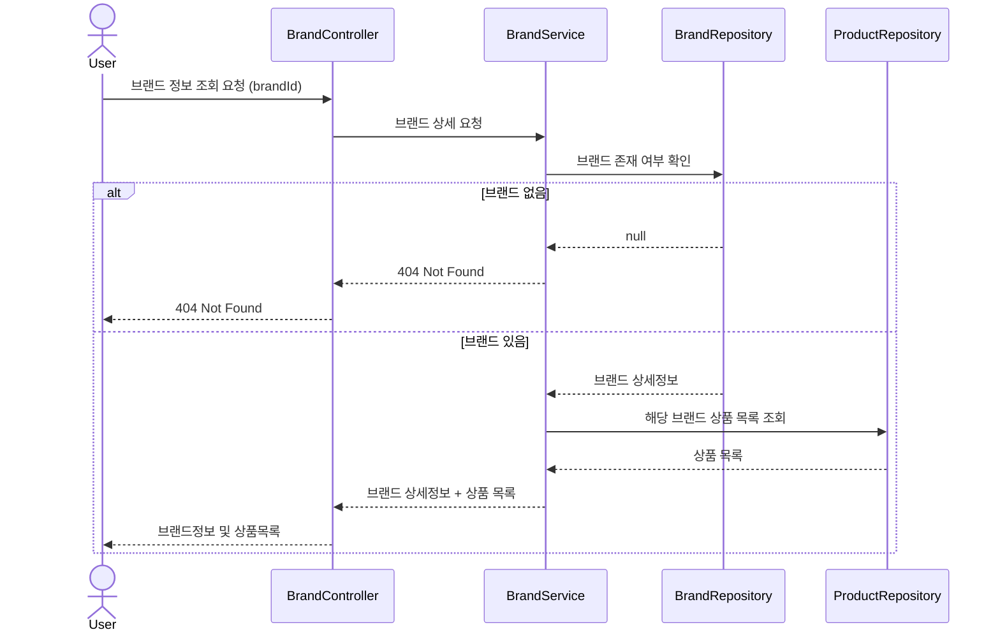
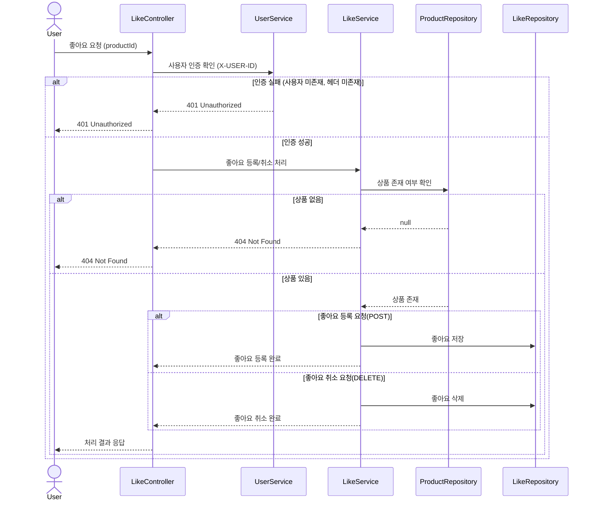
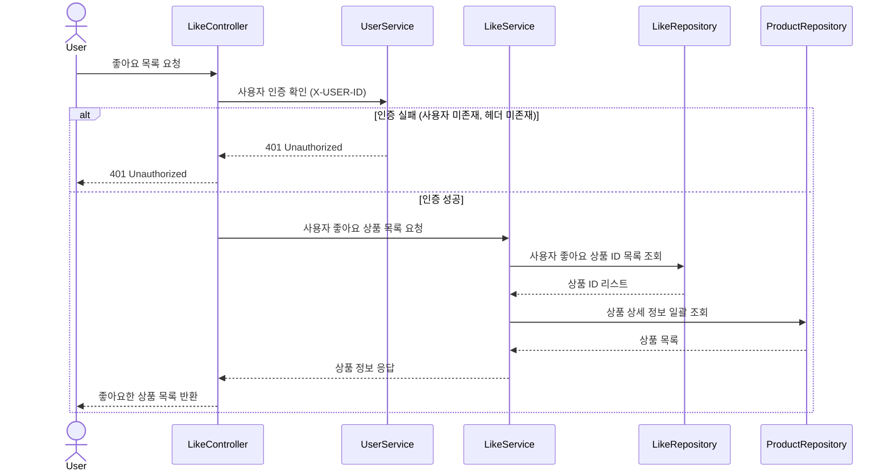
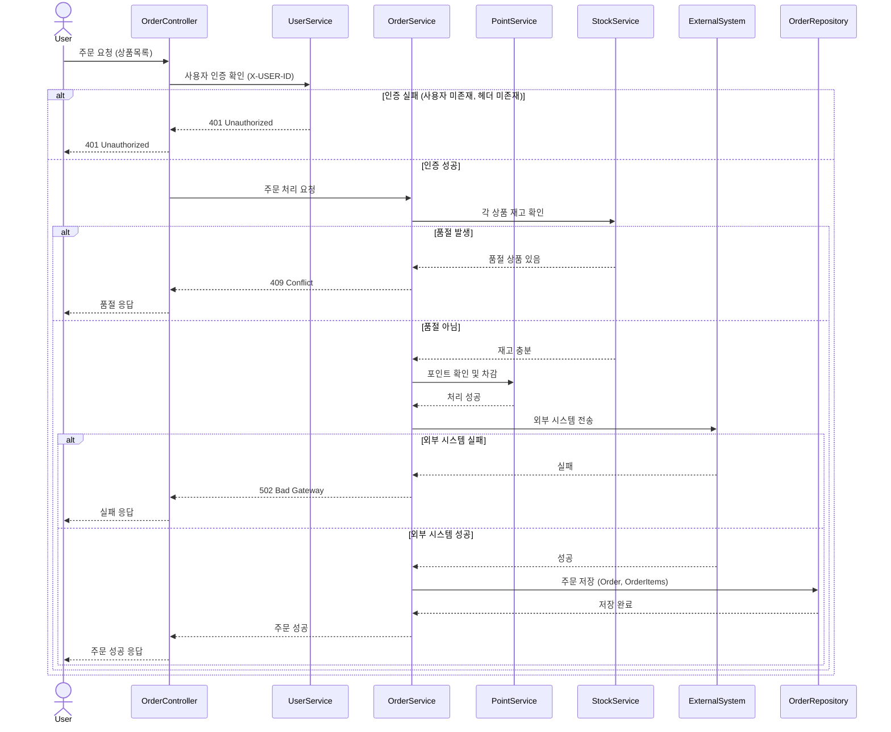
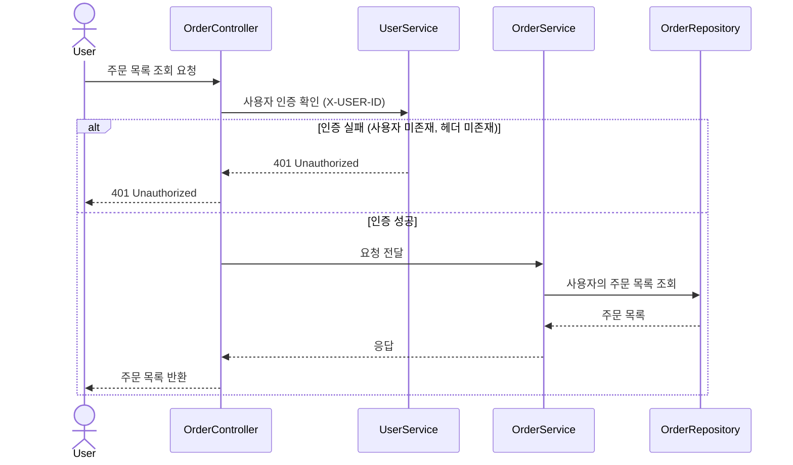
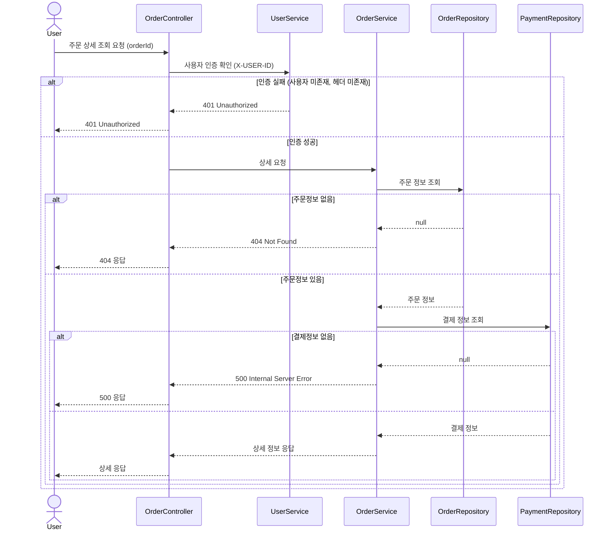

# 시퀀스 다이어그램

---
상품 목록 조회 시퀀스
---

```mermaid

sequenceDiagram
    actor U as User
    participant PC as ProductController
    participant PS as ProductService
    participant PR as ProductRepository
    participant BR as BrandRepository

    U->>PC: 상품 목록 조회 요청 (brandId, sort, page, size)
    PC->>PC: 파라미터 유효성 검증
    alt brandId가 존재할 경우
        PC->>BR: 브랜드 존재 여부 확인
        BR-->>PC: 브랜드 있음 or 없음
        alt 브랜드 없음
            PC-->>U: 400 Bad Request (존재하지 않는 브랜드)
        end
    end
    PC->>PS: 상품 목록 조회 요청
    PS->>PR: 상품 목록 조건 검색
    PR-->>PS: 상품 목록 반환
    PS-->>PC: 상품 목록 응답
    PC-->>U: 상품 목록 응답
```

---
상품 상세 정보 조회
---

```mermaid

sequenceDiagram
actor U as User
participant PC as ProductController
participant PS as ProductService
participant PR as ProductRepository

    U->>PC: 상품 상세 정보 조회 요청 (productId)
    PC->>PS: 상품 상세 정보 요청
    PS->>PR: 상품 존재 여부 및 상세정보 조회
    alt 상품 없음
        PR-->>PS: null
        PS-->>PC: 404 Not Found
        PC-->>U: 404 Not Found
    else 상품 있음
        PR-->>PS: 상품 정보
        PS-->>PC: 상세 정보
        PC-->>U: 상세 정보 응답
    end
```

---
브랜드 정보 조회
---

```mermaid

sequenceDiagram
actor U as User
participant BC as BrandController
participant BS as BrandService
participant BR as BrandRepository
participant PR as ProductRepository

    U->>BC: 브랜드 정보 조회 요청 (brandId)
    BC->>BS: 브랜드 상세 요청
    BS->>BR: 브랜드 존재 여부 확인
    alt 브랜드 없음
        BR-->>BS: null
        BS-->>BC: 404 Not Found
        BC-->>U: 404 Not Found
    else 브랜드 있음
        BR-->>BS: 브랜드 상세정보
        BS->>PR: 해당 브랜드 상품 목록 조회
        PR-->>BS: 상품 목록
        BS-->>BC: 브랜드 상세정보 + 상품 목록
        BC-->>U: 브랜드정보 및 상품목록
    end

```
---
좋아요 등록/취소
---

```mermaid
sequenceDiagram
    actor U as User
    participant LC as LikeController
    participant US as UserService
    participant LS as LikeService
    participant PR as ProductRepository
    participant LR as LikeRepository

    U->>LC: 좋아요 요청 (productId)
    LC->>US: 사용자 인증 확인 (X-USER-ID)
    alt 인증 실패 (사용자 미존재, 헤더 미존재)
        US-->>LC: 401 Unauthorized
        LC-->>U: 401 Unauthorized
    else 인증 성공
        LC->>LS: 좋아요 등록/취소 처리
        LS->>PR: 상품 존재 여부 확인
        alt 상품 없음
            PR-->>LS: null
            LS-->>LC: 404 Not Found
            LC-->>U: 404 Not Found
        else 상품 있음
            PR-->>LS: 상품 존재
            alt 좋아요 등록 요청(POST)
                LS->>LR: 좋아요 저장
                LS-->>LC: 좋아요 등록 완료
            else 좋아요 취소 요청(DELETE)
                LS->>LR: 좋아요 삭제
                LS-->>LC: 좋아요 취소 완료
            end
            LC-->>U: 처리 결과 응답
        end
    end 
```
---
좋아요한 상품 목록 조회
---

```mermaid
sequenceDiagram
    actor U as User
    participant LC as LikeController
    participant US as UserService
    participant LS as LikeService
    participant LR as LikeRepository
    participant PR as ProductRepository

    U->>LC: 좋아요 목록 요청
    LC->>US: 사용자 인증 확인 (X-USER-ID)
    alt 인증 실패 (사용자 미존재, 헤더 미존재)
        US-->>LC: 401 Unauthorized
        LC-->>U: 401 Unauthorized
    else 인증 성공
        LC->>LS: 사용자 좋아요 상품 목록 요청
        LS->>LR: 사용자 좋아요 상품 ID 목록 조회
        LR-->>LS: 상품 ID 리스트
        LS->>PR: 상품 상세 정보 일괄 조회
        PR-->>LS: 상품 목록
        LS-->>LC: 상품 정보 응답
        LC-->>U: 좋아요한 상품 목록 반환
    end
```
---
주문 요청
---

```mermaid

sequenceDiagram
    actor U as User
    participant OC as OrderController
    participant US as UserService
    participant OS as OrderService
    participant PS as PointService
    participant SS as StockService
    participant ES as ExternalSystem
    participant OR as OrderRepository

    U->>OC: 주문 요청 (상품목록)
    OC->>US: 사용자 인증 확인 (X-USER-ID)
    alt 인증 실패 (사용자 미존재, 헤더 미존재)
        US-->>OC: 401 Unauthorized
        OC-->>U: 401 Unauthorized
    else 인증 성공
        OC->>OS: 주문 처리 요청
        OS->>SS: 각 상품 재고 확인
        alt 품절 발생
            SS-->>OS: 품절 상품 있음
            OS-->>OC: 409 Conflict
            OC-->>U: 품절 응답
        else 품절 아님
            SS-->>OS: 재고 충분
            OS->>PS: 포인트 확인 및 차감
            PS-->>OS: 처리 성공
            OS->>ES: 외부 시스템 전송
            alt 외부 시스템 실패
                ES-->>OS: 실패
                OS-->>OC: 502 Bad Gateway
                OC-->>U: 실패 응답
            else 외부 시스템 성공
                ES-->>OS: 성공
                OS->>OR: 주문 저장 (Order, OrderItems)
                OR-->>OS: 저장 완료
                OS-->>OC: 주문 성공
                OC-->>U: 주문 성공 응답
            end
        end
    end
```

---
주문 목록 조회
---

```mermaid

sequenceDiagram
    actor U as User
    participant OC as OrderController
    participant US as UserService
    participant OS as OrderService
    participant OR as OrderRepository

    U->>OC: 주문 목록 조회 요청
    OC->>US: 사용자 인증 확인 (X-USER-ID)
    alt 인증 실패 (사용자 미존재, 헤더 미존재)
        US-->>OC: 401 Unauthorized
        OC-->>U: 401 Unauthorized
    else 인증 성공
        OC->>OS: 요청 전달
        OS->>OR: 사용자의 주문 목록 조회
        OR-->>OS: 주문 목록
        OS-->>OC: 응답
        OC-->>U: 주문 목록 반환
    end 
```

---
주문 상세 조회
---

```mermaid

sequenceDiagram
    actor U as User
    participant OC as OrderController
    participant US as UserService
    participant OS as OrderService
    participant OR as OrderRepository
    participant PR as PaymentRepository

    U->>OC: 주문 상세 조회 요청 (orderId)
    OC->>US: 사용자 인증 확인 (X-USER-ID)
    alt 인증 실패 (사용자 미존재, 헤더 미존재)
        US-->>OC: 401 Unauthorized
        OC-->>U: 401 Unauthorized
    else 인증 성공
        OC->>OS: 상세 요청
        OS->>OR: 주문 정보 조회
        alt 주문정보 없음
            OR-->>OS: null
            OS-->>OC: 404 Not Found
            OC-->>U: 404 응답
        else 주문정보 있음
            OR-->>OS: 주문 정보
            OS->>PR: 결제 정보 조회
            alt 결제정보 없음
                PR-->>OS: null
                OS-->>OC: 500 Internal Server Error
                OC-->>U: 500 응답
            else
                PR-->>OS: 결제 정보
                OS-->>OC: 상세 정보 응답
                OC-->>U: 상세 응답
            end
        end
    end 
```