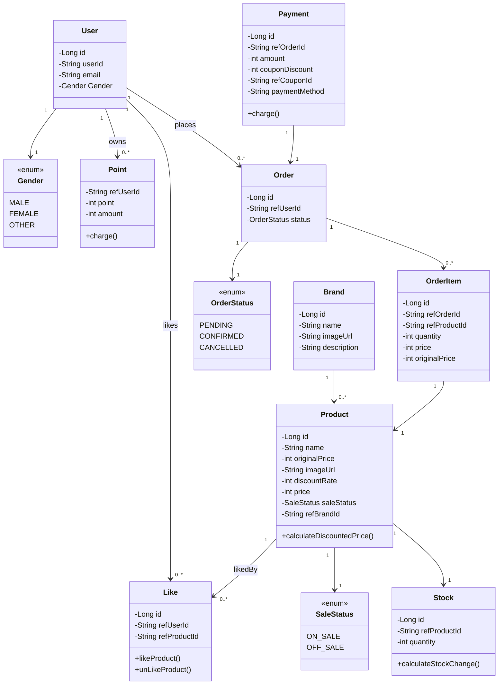

# 클래스 다이어그램

```mermaid
classDiagram
    class User {
        -Long id
        -String userId
        -String email
        -Gender Gender
    }

    class Gender {
        <<enum>>
        MALE
        FEMALE
        OTHER
    }

    class Point {
        -String refUserId
        -int point
        -int amount
        +charge()
    }
    
    class Product {
        -Long id
        -String name
        -int originalPrice
        -String imageUrl
        -int discountRate
        -int price
        -SaleStatus saleStatus
        -String refBrandId
        +calculateDiscountedPrice()
    }

    class SaleStatus {
        <<enum>>
        ON_SALE
        OFF_SALE
    }

    class Brand {
        -Long id
        -String name
        -String imageUrl
        -String description
    }
    
    class Like {
        -Long id
        -String refUserId
        -String refProductId
        +likeProduct()
        +unLikeProduct()
    }
    
    class Order {
        -Long id
        -String refUserId
        -OrderStatus status
    }

    class OrderStatus {
        <<enum>>
        PENDING
        CONFIRMED
        CANCELLED
    }
    
    class OrderItem {
        -Long id
        -String refOrderId
        -String refProductId
        -int quantity
        -int price
        -int originalPrice
    }
    
    class Payment {
        -Long id
        -String refOrderId
        -int amount
        -int couponDiscount
        -String refCouponId
        -String paymentMethod
        +charge()
    }
    
    class Stock {
        -Long id
        -String refProductId
        -int quantity
        +calculateStockChange()
    }

%% Associations
    User "1" --> "1" Gender
    User "1" --> "0..*" Point : owns
    User "1" --> "0..*" Like : likes
    User "1" --> "0..*" Order : places

    Brand "1" --> "0..*" Product
    
    Product "1" --> "1" SaleStatus
    Product "1" --> "1" Stock

    Product "1" --> "0..*" Like : likedBy

    Order "1" --> "0..*" OrderItem
    Order "1" --> "1" OrderStatus

    OrderItem "1" --> "1" Product

    Payment "1" --> "1" Order

```