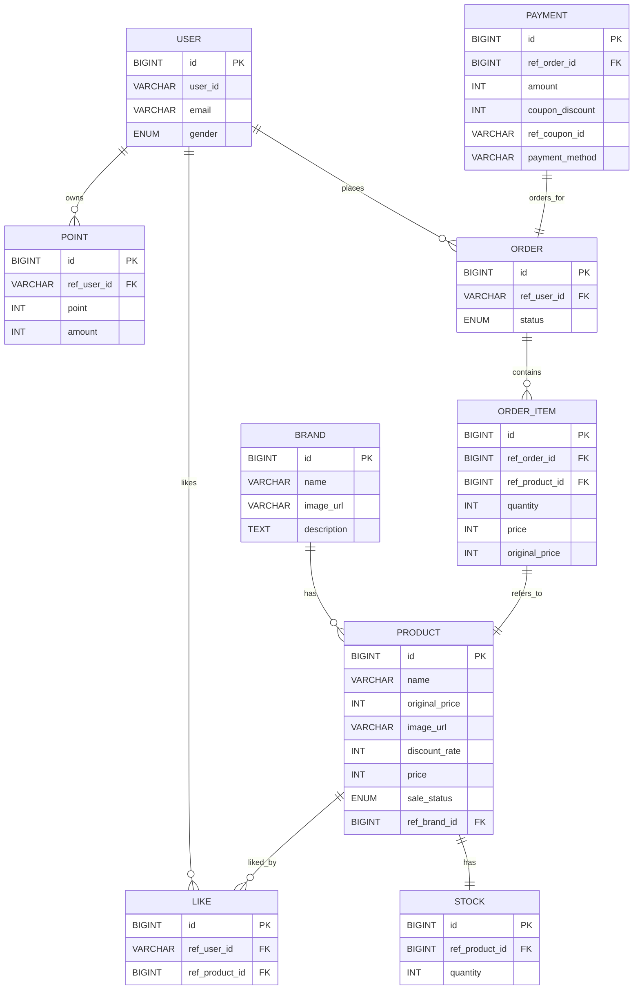

# ERD

```mermaid
erDiagram
    USER {
        BIGINT id PK
        VARCHAR user_id
        VARCHAR email
        ENUM gender
    }

    POINT {
        BIGINT id PK
        VARCHAR ref_user_id FK
        INT point
        INT amount
    }

    PRODUCT {
        BIGINT id PK
        VARCHAR name
        INT original_price
        VARCHAR image_url
        INT discount_rate
        INT price
        ENUM sale_status
        BIGINT ref_brand_id FK
    }

    BRAND {
        BIGINT id PK
        VARCHAR name
        VARCHAR image_url
        TEXT description
    }

    LIKE {
        BIGINT id PK
        VARCHAR ref_user_id FK
        BIGINT ref_product_id FK
    }

    ORDER {
        BIGINT id PK
        VARCHAR ref_user_id FK
        ENUM status
    }

    ORDER_ITEM {
        BIGINT id PK
        BIGINT ref_order_id FK
        BIGINT ref_product_id FK
        INT quantity
        INT price
        INT original_price
    }

    PAYMENT {
        BIGINT id PK
        BIGINT ref_order_id FK
        INT amount
        INT coupon_discount
        VARCHAR ref_coupon_id
        VARCHAR payment_method
    }

    STOCK {
        BIGINT id PK
        BIGINT ref_product_id FK
        INT quantity
    }

%% 관계 설정
    USER ||--o{ POINT : owns
    USER ||--o{ LIKE : likes
    USER ||--o{ "ORDER" : places

    BRAND ||--o{ PRODUCT : has
    PRODUCT ||--|| STOCK : has
    PRODUCT ||--o{ LIKE : liked_by
    ORDER ||--o{ ORDER_ITEM : contains
    ORDER_ITEM ||--|| PRODUCT : refers_to
    PAYMENT ||--|| "ORDER" : orders_for
```